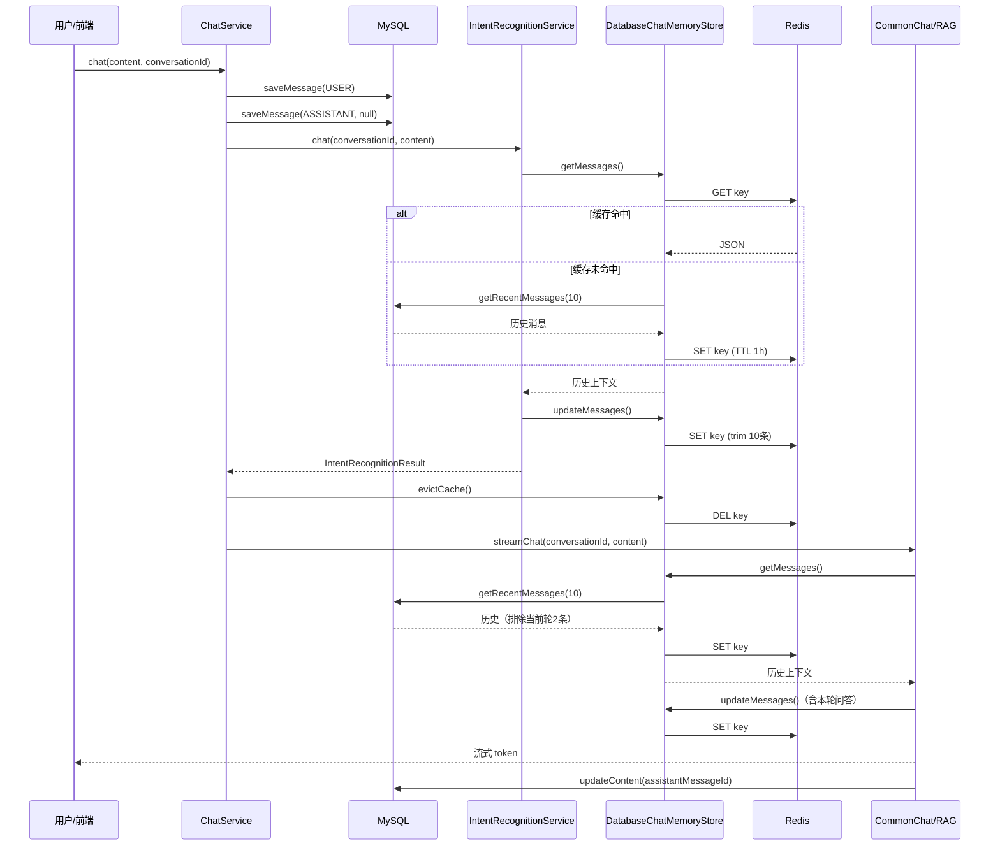

# DatabaseChatMemoryStore 设计说明

> 对应实现类：`know.engine.chat.memory.DatabaseChatMemoryStore`  
> 相关配置：`know.engine.ai.config.MemoryConfig`  
> 业务入口：`know.engine.chat.service.ChatService`

---

## 1. 背景与目标

Know Engine 基于 [LangChain4j](https://github.com/langchain4j/langchain4j) 的 `AiServices` 机制实现多轮对话。LangChain4j 在每次 AI 调用时需要读取/更新「对话记忆」（Chat Memory），以便 LLM 能看到历史上下文。

`DatabaseChatMemoryStore` 是 LangChain4j `ChatMemoryStore` 接口的自定义实现，采用 **Redis 缓存 + MySQL 持久化** 的组合策略，兼顾：

| 目标 | 实现方式 |
|------|----------|
| LLM 推理性能 | Redis 缓存热数据，避免每次调用都查库 |
| 聊天历史不丢失 | MySQL `chat_message` 表完整持久化 |
| 控制 LLM 上下文窗口 | 滑动窗口最多 10 条消息 |
| 多服务共享同一会话记忆 | 统一 `memoryId = conversationId` |

---

## 2. 整体架构

```
┌─────────────────────────────────────────────────────────────────┐
│                     LangChain4j AiServices                       │
│  IntentRecognitionService / CommonChatService / RagChatService   │
└────────────────────────────┬────────────────────────────────────┘
                             │ ChatMemoryProvider
                             │ (MessageWindowChatMemory, max=10)
                             ▼
┌─────────────────────────────────────────────────────────────────┐
│              DatabaseChatMemoryStore (ChatMemoryStore)           │
│                                                                  │
│   getMessages()  ──► Redis 命中? ──是──► 返回缓存                  │
│        │                    │                                    │
│        │                    否                                    │
│        │                    ▼                                    │
│        │            loadFromDatabase()                           │
│        │                    │                                    │
│        │                    ▼                                    │
│        └──────────── saveToRedis() ◄── updateMessages()          │
└────────────┬───────────────────────────────┬────────────────────┘
             │                               │
             ▼                               ▼
    ┌────────────────┐              ┌────────────────────┐
    │     Redis      │              │   MySQL            │
    │  推理缓存层     │              │  chat_message 表   │
    │  最多 10 条     │              │  完整历史记录       │
    │  TTL 1 小时    │              │  不自动删旧消息     │
    └────────────────┘              └────────────────────┘
                                             ▲
                                             │ saveMessage / updateContent
                                             │ （业务层 ChatService 负责）
```

### 2.1 职责分离（重要）

**Redis 和 MySQL 承担不同职责，不是简单的镜像关系：**

| 存储 | 角色 | 写入时机 | 数据范围 |
|------|------|----------|----------|
| **Redis** | LLM 推理用的运行时缓存 | `getMessages` 回源后、`updateMessages` 被 LangChain4j 调用时 | 最近 10 条 LangChain4j `ChatMessage` |
| **MySQL** | 持久化真相源（Source of Truth） | `ChatService.chat()` 开始时 `saveMessage`，流式结束时 `updateContent` | **全部**历史消息，无自动截断 |

> **「只保留最近 10 条」指的是 LLM 上下文窗口（Redis + LangChain4j 内存层），并非 MySQL 物理删除旧数据。**

---

## 3. 核心常量

| 常量 | 值 | 说明 |
|------|----|------|
| `REDIS_KEY_PREFIX` | `know-engine:chat-memory:` | Redis Key 前缀 |
| `MAX_MESSAGES` | `10` | LLM 上下文最大消息条数 |
| `CACHE_TTL_HOURS` | `1` | Redis 缓存过期时间（小时） |

Redis Key 完整格式：

```
know-engine:chat-memory:{conversationId}
```

---

## 4. 核心方法说明

### 4.1 `getMessages(Object memoryId)`

**调用方**：LangChain4j `MessageWindowChatMemory`，在 AI 服务发起推理前读取历史上下文。

**流程**：

1. 构造 Redis Key：`know-engine:chat-memory:{conversationId}`
2. 尝试从 Redis 读取 JSON 并反序列化为 `List<ChatMessage>`
3. **缓存命中** → 直接返回
4. **缓存未命中**（Key 不存在 / 已过期 / Redis 异常）→ 调用 `loadFromDatabase()` 从 MySQL 加载 → 写入 Redis（带 TTL）→ 返回

```java
// 伪代码
String json = redis.get(key);
if (json != null) return deserialize(json);

List<ChatMessage> messages = loadFromDatabase(conversationId);
saveToRedis(key, messages);
return messages;
```

### 4.2 `updateMessages(Object memoryId, List<ChatMessage> messages)`

**调用方**：LangChain4j 在同一次 `AiServices` 调用过程中，每次 `add()` 新消息或调整记忆窗口时回调。

**行为**：

1. 调用 `trimMessages()` 截断为最近 10 条
2. **仅写入 Redis**，不操作 MySQL

**为什么只更新 Redis？**

- `ChatMemoryStore` 是 LangChain4j 的**运行时状态管理接口**，职责是维护单次/多次 AI 调用内的上下文一致性
- MySQL 持久化由业务层 `ChatService` 独立负责（见第 5 节），两者解耦
- 若在 `updateMessages` 中同步写库，会导致：
  - 流式生成过程中频繁写库（性能差）
  - 与 `saveMessage` / `updateContent` 的业务语义冲突（重复插入、内容不完整）

### 4.3 `deleteMessages(Object memoryId)`

**调用方**：删除会话时（如 `ChatConversationController`）。

**行为**：同时删除 Redis Key 和 MySQL 中该 `conversationId` 下的全部消息。

> 这是唯一会**同时清理 Redis 和 MySQL** 的操作。

### 4.4 `evictCache(Object memoryId)`（公共方法）

**调用方**：`ChatService.routeByIntent()`，在意图识别完成后、进入闲聊/RAG 回答前。

**行为**：仅删除 Redis Key，**不删 MySQL 数据**。

**目的**：强制后续 `getMessages()` 从 MySQL 重新加载「干净」的历史上下文，避免意图识别阶段写入 Redis 的中间状态污染 RAG/闲聊的推理上下文。

### 4.5 `loadFromDatabase(String conversationId)`（私有）

从 MySQL 加载历史并转换为 LangChain4j 消息对象：

1. 调用 `chatMessageService.getRecentMessages(conversationId, MAX_MESSAGES)`
2. 过滤 `content` 为空的消息（流式进行中助手消息尚未回填）
3. 仅转换 `USER` → `UserMessage`、`ASSISTANT` → `AiMessage`

#### `getRecentMessages` 的特殊逻辑

```java
// ChatMessageServiceImpl.getRecentMessages(conversationId, limit)
// 1. 按 created_at 降序查 limit+2 条
// 2. 去掉最新的 2 条（当前轮次刚插入的用户消息 + 空助手占位消息）
// 3. 反转后按时间正序返回
```

这样设计是因为：每轮对话开始时，`ChatService` 会**先**把本轮用户消息和空助手消息写入 MySQL，**再**触发 AI 推理。从 DB 回源加载历史时，需要排除这 2 条「当前轮次占位记录」，避免重复；本轮用户消息由 LangChain4j 在调用时通过 `@UserMessage` 参数注入。

---

## 5. 完整对话时序

以 `ChatService.chat()` 一次用户提问为例：

```
用户发送消息
    │
    ▼
[1] resolveConversationId（新建或复用会话）
    │
    ▼
[2] MySQL: saveMessage(USER, content)          ← 持久化用户消息
    MySQL: saveMessage(ASSISTANT, null)        ← 预插入空助手占位
    │
    ▼
[3] IntentRecognitionService.chat(conversationId, content)
    │   └─ LangChain4j 读记忆: getMessages() → Redis/DB
    │   └─ 推理完成后: updateMessages() → Redis（含本轮上下文）
    │
    ▼
[4] evictCache(conversationId)                 ← 清除 Redis，DB 不动
    │
    ▼
[5] 路由: 闲聊 or RAG
    │
    ├─ 闲聊: CommonChatService.streamChat(conversationId, content)
    │         └─ getMessages() → DB 回源（排除当前轮 2 条占位）
    │         └─ LangChain4j 注入 @UserMessage，updateMessages() → Redis
    │         └─ 流式 token 输出
    │         └─ doOnComplete: updateContent(assistantMessageId) → MySQL
    │
    └─ RAG: RagChatService.streamChat(...)
              └─ 同上记忆读写策略
              └─ 问题改写器 KnowEngineQueryTransformer 从 Query metadata 读取历史
              └─ doOnComplete: updateContent → MySQL
    │
    ▼
[6] 发送 [DONE]:conversationId
```

### Mermaid 时序图



---

## 6. 与 LangChain4j 的集成

### 6.1 MemoryConfig

```java
@Bean
public ChatMemoryProvider conversationChatMemoryProvider(DatabaseChatMemoryStore store) {
    return memoryId -> MessageWindowChatMemory.builder()
            .id(memoryId)
            .maxMessages(10)          // LangChain4j 层再次限制窗口
            .chatMemoryStore(store)
            .build();
}
```

双层窗口限制：

1. **`MessageWindowChatMemory.maxMessages(10)`**：LangChain4j 在 `add()` 时自动截断
2. **`DatabaseChatMemoryStore.trimMessages(10)`**：写入 Redis 前再次截断（防御性）

### 6.2 使用该 MemoryProvider 的服务

| 服务 | 用途 | memoryId |
|------|------|----------|
| `IntentRecognitionService` | 意图识别（知识问答 vs 闲聊） | `conversationId` |
| `CommonChatService` | 通用闲聊流式回答 | `conversationId` |
| `RagChatService`（ChatService 内动态构建） | RAG 知识问答流式回答 | `conversationId` |

三个服务共用同一个 `conversationChatMemoryProvider`，保证同一会话在不同 AI 链路间上下文一致。

---

## 7. Redis 与 MySQL 的数据一致性

### 7.1 预期的「不一致」（设计如此）

| 场景 | Redis 状态 | MySQL 状态 | 是否问题 |
|------|-----------|-----------|----------|
| 会话有 50 轮历史 | 最近 10 条 | 全部 100 条（50×2） | 否，职责不同 |
| 流式生成进行中 | 含 AI 部分/完整回复 | 助手消息 content=null | 否，完成后 `updateContent` 回填 |
| 意图识别刚结束 | 已被 evictCache 清空 | 含本轮占位 2 条 | 否，下次从 DB 回源 |
| Redis TTL 1h 过期 | Key 不存在 | 全部历史仍在 | 否，下次 getMessages 回源 |

### 7.2 不会丢数据

MySQL 是持久化真相源。Redis 只是可重建的缓存：

- 过期 → `getMessages()` 从 DB 回源
- 手动 `evictCache()` → 同上
- Redis 故障 → 降级读 DB（见 `getMessages` 的 try-catch）

### 7.3 需要注意的视图差异

- **前端聊天列表**（查 MySQL API）：展示完整历史
- **LLM 推理上下文**（经 Redis/ChatMemory）：最多 10 条滑动窗口

若产品需要「LLM 也能看到超过 10 轮的历史」，需调大 `MAX_MESSAGES` 和 `MemoryConfig.maxMessages`，并评估 token 成本。

---

## 8. 消息类型与过滤规则

当前 `ChatMessageType` 枚举仅包含：

- `USER`：用户消息
- `ASSISTANT`：助手回复

`loadFromDatabase()` 只加载上述两种类型，且跳过 `content` 为空的消息。

代码注释提到「过滤意图识别结果消息（INTENT_RECOGNITION）」——当前枚举中尚无该类型；若未来扩展新类型，只要不映射为 `USER`/`ASSISTANT`，就不会进入 LLM 上下文。

---

## 9. 常见问题（FAQ）

### Q1：超过 10 条消息后，MySQL 里的旧消息会被删除吗？

**不会。** MySQL 永久保留全部历史。10 条限制仅作用于 Redis 缓存和 LLM 上下文窗口。只有调用 `deleteMessages()`（删会话）时才会清 MySQL。

### Q2：`updateMessages` 为什么不同步写 MySQL？

因为它是 LangChain4j 的运行时缓存回调。MySQL 写入由 `ChatService` 在明确的业务节点完成：

- 对话开始 → `saveMessage`
- 流式结束 → `updateContent`

这样避免流式过程中频繁写库，也避免与占位消息机制冲突。

### Q3：意图识别后为什么要 `evictCache`？

意图识别也会读写 ChatMemory（写入 Redis）。但意图识别的中间上下文不应带入后续 RAG/闲聊推理。清 Redis 后，下一轮 `getMessages` 从 DB 加载干净的历史（排除当前轮占位），再由 LangChain4j 注入本轮用户消息。

### Q4：Redis 挂了怎么办？

`getMessages()` 捕获 Redis 异常后会降级读 MySQL；`updateMessages()` / `saveToRedis()` 失败仅打 warn 日志，不阻断主流程。极端情况下 LLM 可能缺少跨请求的上下文，但单轮 `@UserMessage` 仍可正常回答。

### Q5：如何调整上下文窗口大小？

需同时修改两处保持一致：

1. `DatabaseChatMemoryStore.MAX_MESSAGES`
2. `MemoryConfig.conversationChatMemoryProvider()` 中的 `.maxMessages(10)`

### Q6：如何手动清除某会话的缓存？

```java
databaseChatMemoryStore.evictCache(conversationId);
```

或在 Redis 中删除 Key：`know-engine:chat-memory:{conversationId}`

---

## 10. 扩展建议

若后续有需要，可考虑：

1. **MySQL 历史裁剪**：定期任务删除超出 N 条/ N 天的旧消息（当前未实现）
2. **可配置窗口大小**：将 `MAX_MESSAGES` 和 TTL 提取到 `application.yml`
3. **监控**：Redis 命中率、回源 DB 频率、Key 数量